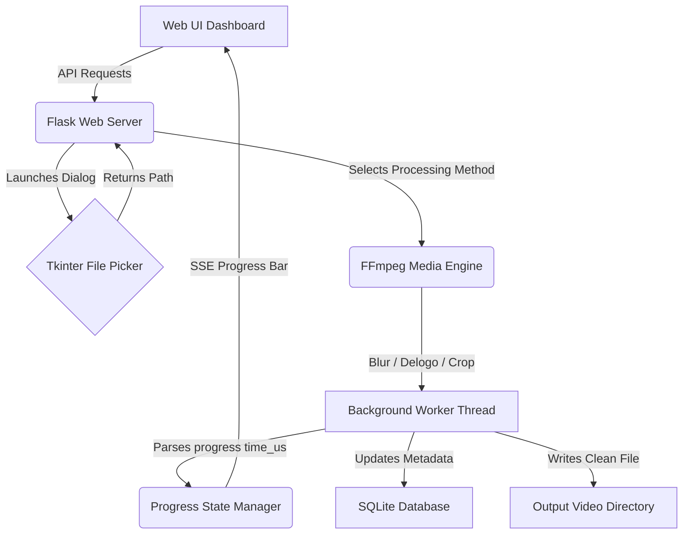

# 🎬 Advanced Video Watermark Remover & Post-Production Tool

[](LICENSE)
[](requirements.txt)
[](https://ffmpeg.org)
[](database.py)

A robust, full-featured Python Flask post-production utility designed to clean video files by blurring or erasing watermarks, trimming intro/outro segments, and stitching custom end-screens. The tool features native desktop directory integration using Tkinter file pickers, real-time FFmpeg CLI subprocess progress tracking, and secure SQLite authentication.

---

## 👨‍💻 Credits & System Architecture Roles

This system was designed, co-engineered, and optimized by **[Nil Patel](https://nilpatel.snpsolutions.co.nz)** (Lead Systems Architect & Core Developer).

*   **FFmpeg Filters & Math Formulas**: Nil Patel
*   **Desktop Integration (Tkinter/Subprocess)**: Nil Patel
*   **Flask API & Database Persistence**: Nil Patel

For collaboration, support, or production setups, contact **Nil Patel** via:
*   🌐 **Portfolio**: [nilpatel.snpsolutions.co.nz](https://nilpatel.snpsolutions.co.nz)
*   🐙 **GitHub**: [github.com/nilpatel7530](https://github.com/nilpatel7530)
*   ✉️ **Email**: [nilpatel7530@gmail.com](mailto:nilpatel7530@gmail.com)

---

## 🏗️ System Architecture & Workflow Pipeline

The tool bridges local Windows desktop operations with web interfaces, executing long-running media compilations asynchronously in background threads.



### Component Structure

| Script File | Core Functional Responsibility |
|:---|:---|
| [`app.py`](./app.py) | Bootstraps the Flask server, exposes APIs, manages async worker pools, and handles PyInstaller frozen asset mapping. |
| [`database.py`](./database.py) | Connects to `users.db` and registers authentication credentials. |
| [`build_dist.py`](./build_dist.py) | Script to compile the Python project into a standalone executable using PyInstaller. |
| [`keygen.py`](./keygen.py) | Generates license keys for locking standalone builds. |

---

## ⚙️ Watermark Removal Algorithms & Mathematical Formulas

The tool provides three watermark removal options implemented via custom FFmpeg filtergraphs:

### 1. Smart Pixel Blurring (Bicubic Scaling)
To blur a watermark region dynamically, the crop window is isolated, downscaled to $6 \times 6$ pixels (destroying metadata), upscaled back using bicubic interpolation, and box-blurred:
```bash
[0:v]crop=w:h:x:y,scale=6:6:flags=bicubic,scale=w:h:flags=bicubic,boxblur=luma_radius=10:luma_power=2[blurred];[0:v][blurred]overlay=x:y
```

### 2. Bounding Box Pixel Interpolation (`delogo`)
Uses the FFmpeg `delogo` filter to seamlessly dissolve borders by interpolating surrounding pixels into the watermark region:
```bash
delogo=x=10:y=20:w=100:h=50:band=1
```

### 3. Coordinate Cropping
Trims off watermarked edges entirely by recalculating frame bounds and rendering the centered crop frame.

---

## 💾 Database Schema (SQLite)

The database schema (`users.db`) manages user permissions and preferences:

```sql
CREATE TABLE IF NOT EXISTS users (
    id INTEGER PRIMARY KEY AUTOINCREMENT,
    username TEXT UNIQUE NOT NULL,
    password_hash TEXT NOT NULL,
    created_at TIMESTAMP DEFAULT CURRENT_TIMESTAMP
);

CREATE TABLE IF NOT EXISTS user_settings (
    user_id INTEGER PRIMARY KEY,
    end_screen_enabled INTEGER DEFAULT 0,
    end_screen_path TEXT,
    end_screen_duration REAL DEFAULT 3.0,
    FOREIGN KEY(user_id) REFERENCES users(id)
);
```

---

## 🚀 Installation & Operating Guide

### Prerequisites
*   Python 3.9+ ([Download](https://www.python.org/downloads/))
*   FFmpeg binaries on the system path (`PATH`) or placed inside the root directory.

### Local Setup

1.  **Clone and Navigate to Project Directory**:
    ```bash
    git clone https://github.com/nilpatel7530/video_watermark_remover_by_Nil_Patel.git
    cd video_watermark_remover_by_Nil_Patel
    ```

2.  **Configure Virtual Environment**:
    ```bash
    python -m venv .venv
    .venv\Scripts\activate
    ```

3.  **Install Requirements**:
    ```bash
    pip install -r requirements.txt
    ```

4.  **Run the Server**:
    ```bash
    python app.py
    ```

5.  **Open in Web Browser**:
    *   Navigate to: `http://localhost:5000`

---

## 🔌 API Endpoint Documentation

### 1. Register User
*   **URL**: `/api/auth/register`
*   **Method**: `POST`
*   **Payload**:
    ```json
    {
      "username": "creator",
      "password": "secure_password",
      "confirm_password": "secure_password"
    }
    ```
*   **Response (200 OK)**:
    ```json
    { "success": true, "message": "Registration successful." }
    ```

### 2. Directory Selector (Tkinter Bridge)
*   **URL**: `/api/select-directory`
*   **Method**: `POST`
*   **Response (200 OK)**:
    ```json
    { "success": true, "directory": "C:/Users/Nilpa/Videos/Source" }
    ```

### 3. Get Video Info (FFprobe Analysis)
*   **URL**: `/api/video-info`
*   **Method**: `POST`
*   **Payload**:
    ```json
    { "filepath": "C:/Users/Nilpa/Videos/Source/input.mp4" }
    ```
*   **Response (200 OK)**:
    ```json
    {
      "width": 1920,
      "height": 1080,
      "fps": 30.0,
      "duration": 59.4,
      "format": "mov,mp4"
    }
    ```

---

## 🛡️ Error Tolerance & Robustness Design

*   **FFmpeg Progress Calculation**: The application reads `stderr` from the FFmpeg subprocess in real-time, parsing `out_time_us` progress and comparing it to the total video length to push highly accurate progress percentage values back to the UI.
*   **Tkinter Mainloop Thread Isolation**: Launches GUI selectors inside separate UI threads, preventing the main Flask process from freezing while a native Windows dialog box is open.
*   **PyInstaller Packaging Compatibility**: Uses `sys._MEIPASS` path maps when compiled into a standalone `.exe`, automatically targeting local directory copies of `ffmpeg.exe` and templates.

---

## 📄 License

This project is licensed under the MIT License - see the [LICENSE](LICENSE) file for details.

Co-engineered with ❤️ by **[Nil Patel](https://nilpatel.snpsolutions.co.nz)**. If this project helps you prepare videos, drop a star! ⭐
